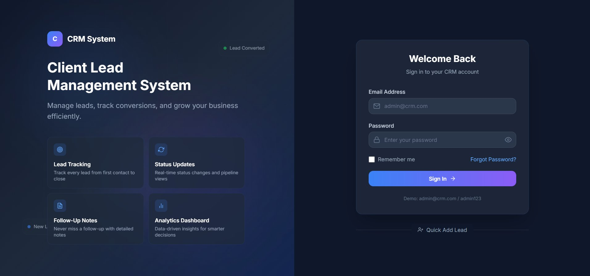
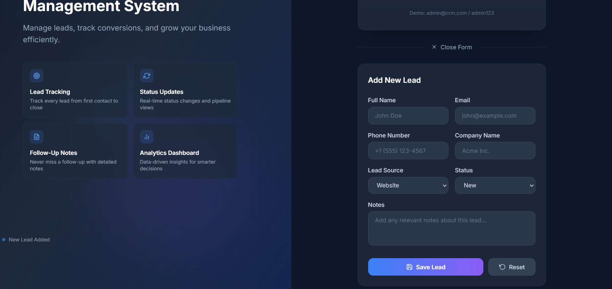
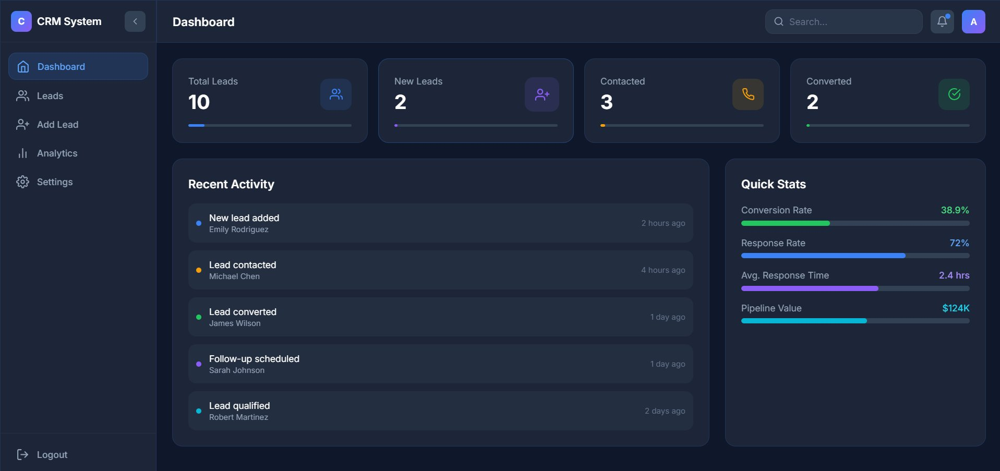
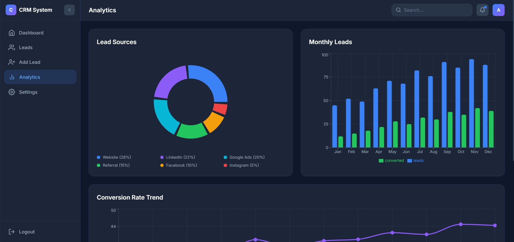
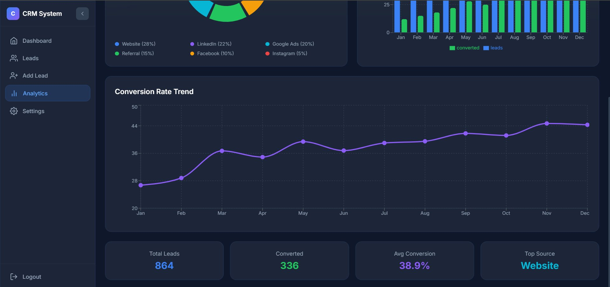

# CRM System — Client Lead Management

A responsive, dark-themed **Client Lead Management System** built with React, TypeScript, and Vite. Manage leads, track conversions, and visualise pipeline performance — all from a clean single-page application.

🔗 **Live Demo:** [https://rctask2.vercel.app/](https://rctask2.vercel.app/)  
📧 **Demo credentials:** `admin@crm.com` / `admin123`

---

## Screenshots

### Login Page


### Add New Lead (Quick Form on Login)


### Dashboard


### Analytics — Lead Sources & Monthly Leads


### Analytics — Conversion Rate Trend & Summary Stats


---

## Features

- **Authentication** — Simple credential-based login with session persistence via `localStorage`.
- **Dashboard** — At-a-glance stats (Total Leads, New, Contacted, Converted) plus recent activity feed and quick KPI metrics (Conversion Rate, Response Rate, Pipeline Value).
- **Lead Management** — Full CRUD: add, view, update status, and delete leads. Each lead stores name, email, phone, company, source, status, notes, and date.
- **Lead Detail Modal** — Click any lead to open an inline modal with full details and inline status editing.
- **Analytics Page** — Lead sources donut chart, Monthly Leads bar chart (leads vs converted), Conversion Rate Trend line chart, and summary stat cards — all powered by Recharts.
- **Add Lead Form** — Validated form with fields for name, email, phone, company, lead source (Website / LinkedIn / Google Ads / Referral / Facebook / Instagram), status, and free-text notes.
- **Settings Page** — User preference configuration.
- **Sidebar Navigation** — Collapsible sidebar with Dashboard, Leads, Add Lead, Analytics, Settings, and Logout.
- **Animations** — Smooth page transitions and micro-interactions via Framer Motion.
- **Responsive Design** — Tailwind CSS utility classes; works on desktop and tablet viewports.

---

## Tech Stack

| Layer | Technology |
|---|---|
| Framework | React 18 |
| Language | TypeScript 5 |
| Build Tool | Vite 5 |
| Styling | Tailwind CSS 3 |
| Routing | React Router DOM 7 |
| Charts | Recharts 3 |
| Icons | Lucide React + React Icons |
| Animation | Framer Motion 12 |
| Backend (optional) | Supabase JS client (dependency included) |
| Linting | ESLint 9 + typescript-eslint |

---

## Project Structure

```
src/
├── components/
│   ├── AnalyticsCharts.tsx   # Recharts wrappers (donut, bar, line)
│   ├── LeadDetailModal.tsx   # Lead detail overlay
│   ├── LeadForm.tsx          # Add/edit lead form
│   ├── LeadTable.tsx         # Sortable leads table
│   ├── LoginForm.tsx         # Auth form with validation
│   ├── Navbar.tsx            # Top navigation bar
│   ├── Sidebar.tsx           # Collapsible sidebar
│   └── StatsCard.tsx         # Dashboard KPI card
├── data/
│   ├── analyticsData.ts      # Static chart data
│   └── sampleLeads.ts        # Seed data + Lead type definition
├── hooks/
│   ├── useAuth.ts            # Login / logout / session persistence
│   └── useLeads.ts           # Lead CRUD + derived stats
├── layouts/
│   └── DashboardLayout.tsx   # Sidebar + Navbar shell for authed pages
├── pages/
│   ├── AddLeadPage.tsx
│   ├── AnalyticsPage.tsx
│   ├── DashboardPage.tsx
│   ├── LeadsPage.tsx
│   ├── LoginPage.tsx
│   └── SettingsPage.tsx
├── routes/
│   └── AppRoutes.tsx         # Route guard: login vs authed layout
├── utils/
│   └── validation.ts         # Form field validators
├── App.tsx
└── main.tsx
```

---

## Getting Started

### Prerequisites

- Node.js ≥ 18
- npm ≥ 9 (or pnpm / yarn)

### Installation

```bash
# Clone the repository
git clone https://github.com/<your-username>/FUTURE_FS_02.git
cd FUTURE_FS_02

# Install dependencies
npm install

# Start the development server
npm run dev
```

The app will be available at `http://localhost:5173`.

### Available Scripts

| Command | Description |
|---|---|
| `npm run dev` | Start Vite dev server with HMR |
| `npm run build` | Type-check and bundle for production |
| `npm run preview` | Preview the production build locally |
| `npm run lint` | Run ESLint across all source files |
| `npm run typecheck` | Run TypeScript compiler without emitting files |

---

## Data Model

```ts
interface Lead {
  id: string;
  fullName: string;
  email: string;
  phone: string;
  company: string;
  source: 'Website' | 'LinkedIn' | 'Google Ads' | 'Referral' | 'Facebook' | 'Instagram';
  status: 'New' | 'Contacted' | 'Qualified' | 'Converted' | 'Lost';
  notes: string;
  date: string; // ISO date string
}
```

Lead state is managed in-memory via the `useLeads` hook. Data resets on page refresh unless wired to a Supabase backend.

---

## Authentication

Authentication is handled client-side with hardcoded demo credentials:

| Field | Value |
|---|---|
| Email | `admin@crm.com` |
| Password | `admin123` |

Session state is persisted to `localStorage` under the key `crm_auth`. To connect a real auth provider, replace the logic inside `src/hooks/useAuth.ts`.

---

## Deployment

The project is deployed on **Vercel** with zero configuration (Vite preset auto-detected).

To deploy your own fork:

```bash
npm run build        # outputs to /dist
# then drag /dist into Vercel, or connect the repo for automatic CI/CD
```

---

## Roadmap / Potential Improvements

- [ ] Connect Supabase for persistent lead storage and real auth
- [ ] Role-based access (admin vs sales rep)
- [ ] Email notifications / follow-up reminders
- [ ] CSV import / export for leads
- [ ] Kanban pipeline view (drag-and-drop status columns)
- [ ] Mobile-first responsive overhaul

---

## License

MIT — free to use and modify.
